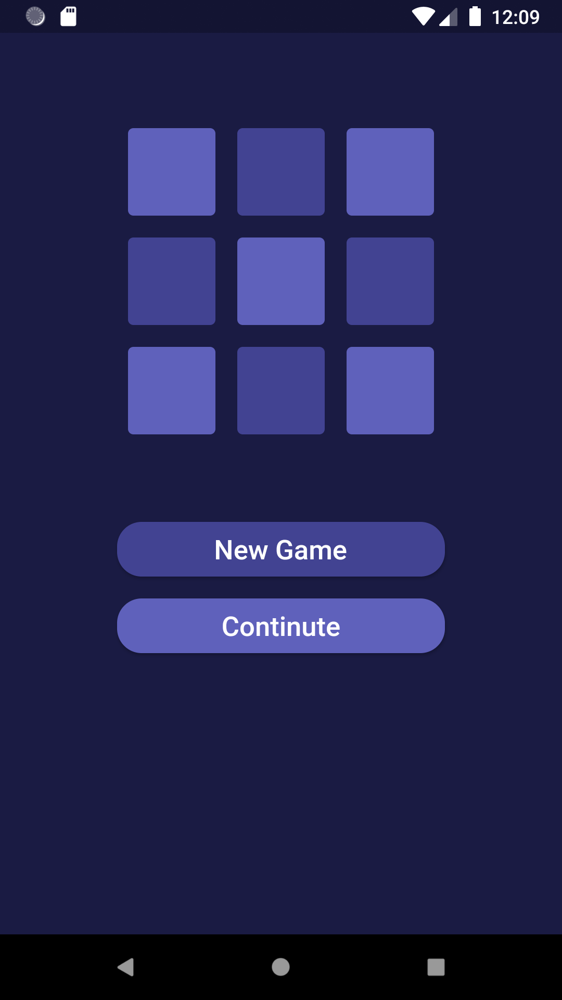
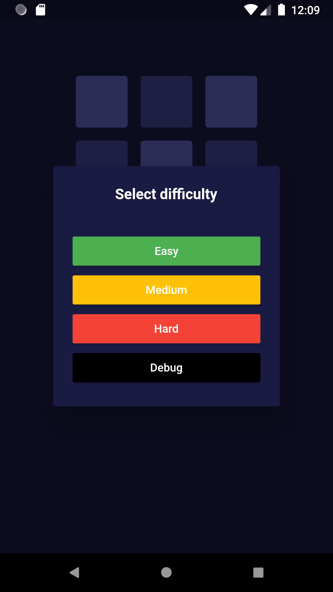
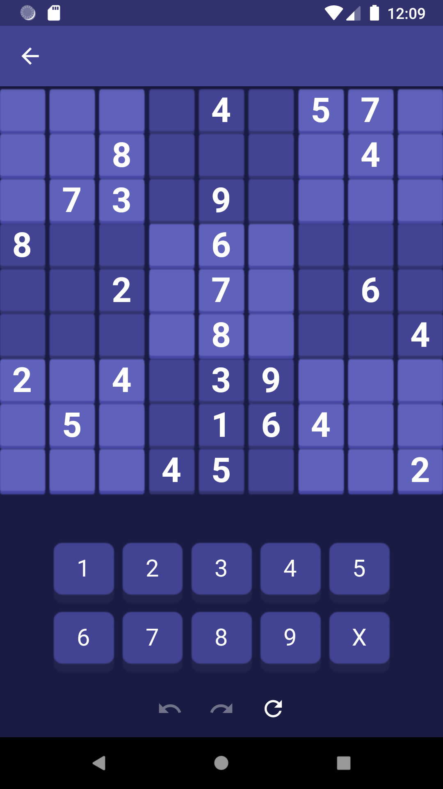
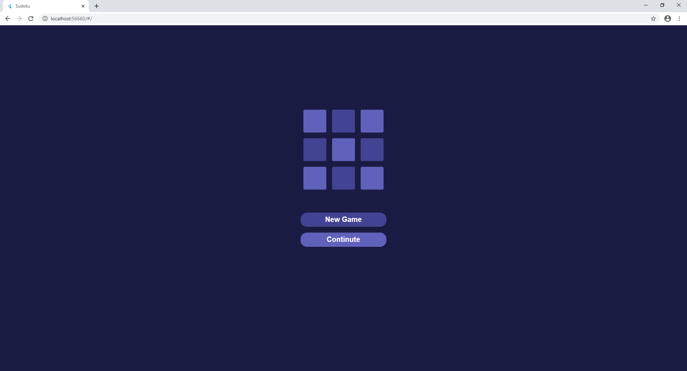
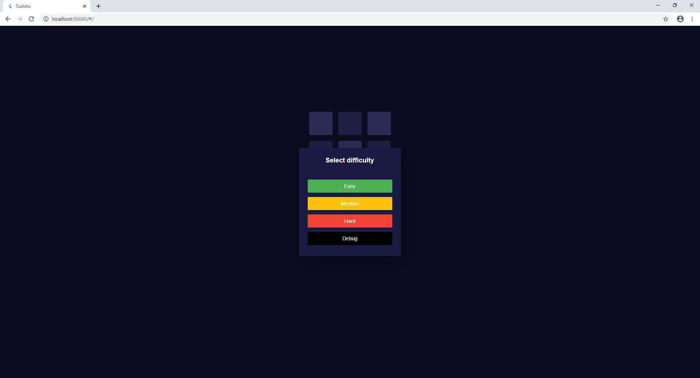
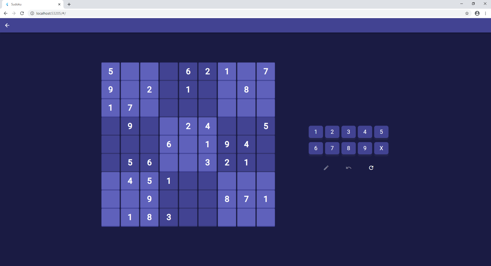

# Sudoku

Simple sudoku with recursive generation algorithm done in flutter, using bloc architecture.
Game is tested for android and web, but should work aswell on IOS, i've tried to use plugins that work on all platforms/make code that allows me to use proper implementations based on current platform (i.e. saving progress) [provider](https://pub.dev/packages/provider) and [rxdart](https://pub.dev/packages/rxdart).

## TODO

- Undo/Red
- Runtime changable themes using Provider
- Animations
- I18n
- Tests
- Tips
- Make keyboard work on web (Works currently only on android, on IOS should too but i didn't test it)

## Screenshots

### Android

- Main Menu

- Select Difficulty Dialog

- Game

### WEB

- Main Menu

- Select Difficulty Dialog

- Game

